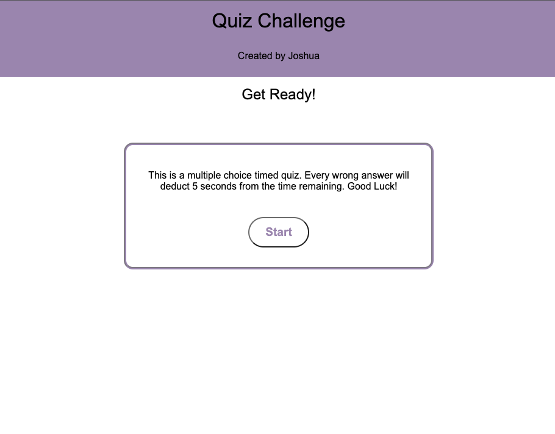
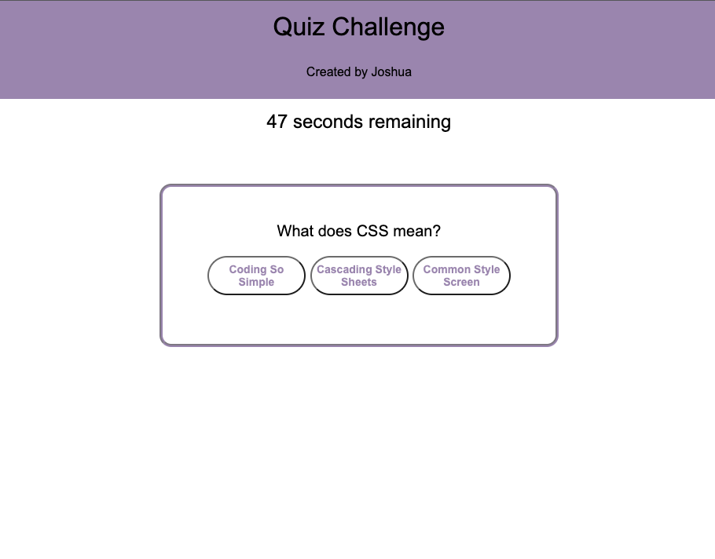
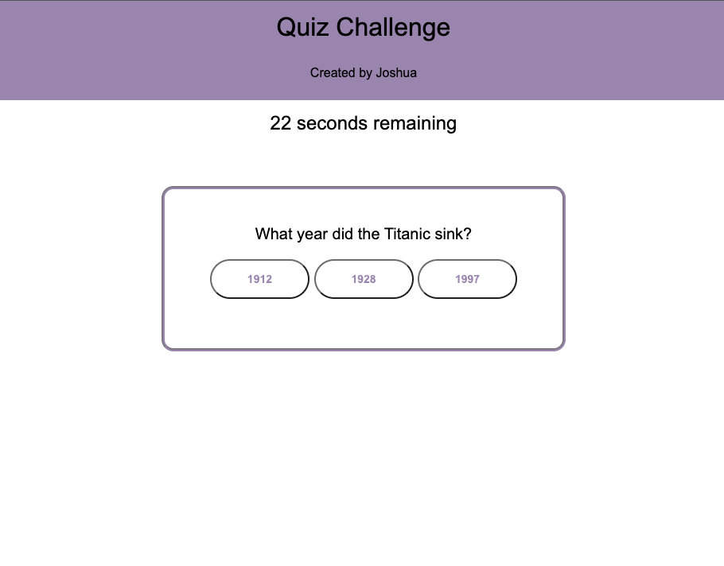
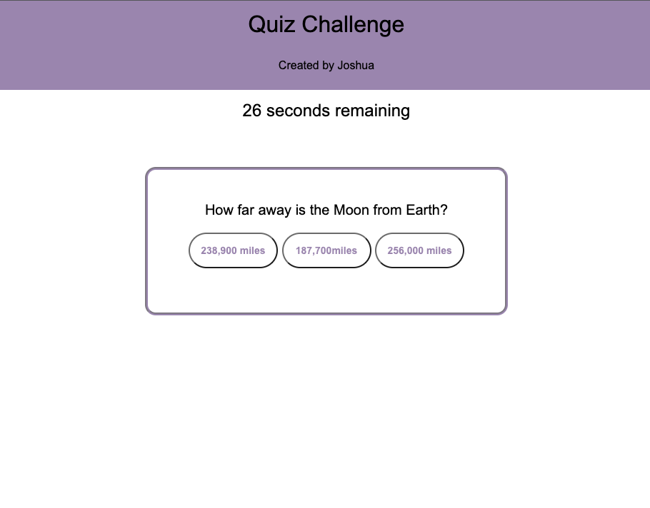
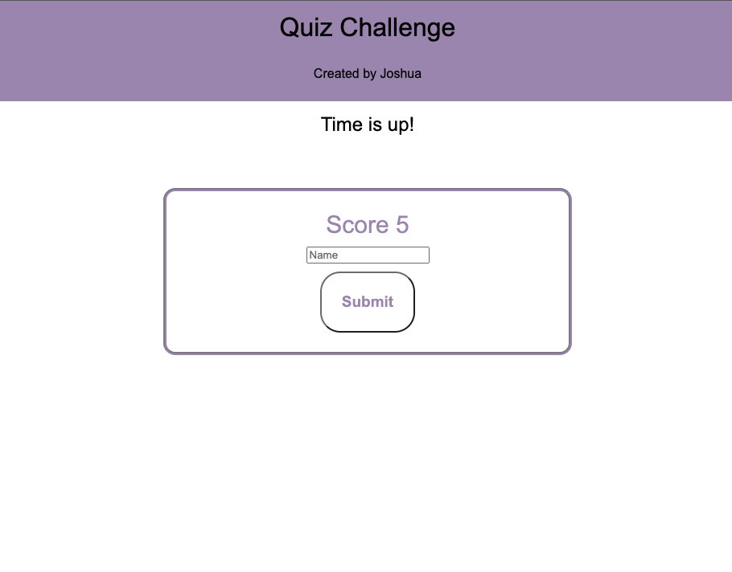
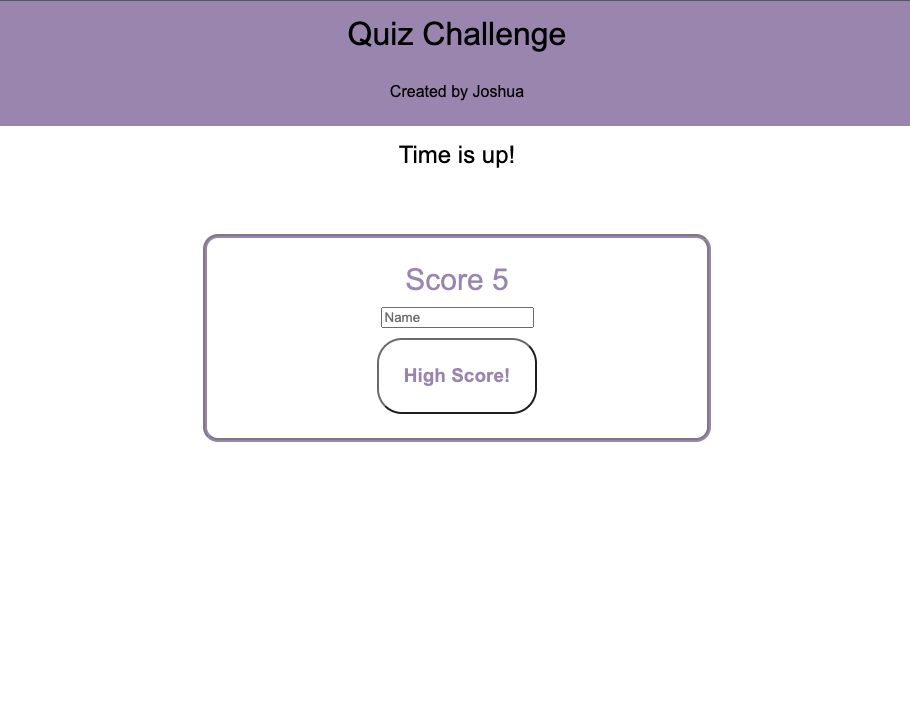

# Quiz-Challenge

**[View Deployed Site](https://joshf2797.github.io/Qiuz-Challenge/)**

## This is a short quiz to test your knowledge

 

 This quiz will ask the user three questions. Each correct answer will add 5 points to the users total score. Each incorrect answer will subtract ten seconds from the users remaining time. After the last question, the timer will stop, the users score will appear and ask for a name. After user submits, the user will be able to check the time scores.

 

## The user will see an opening message and a start button.

 

## After clicking the start button, the user will be shown the first question and the timer will start.

 

## After selecting the answer to the first question, the user will be shown the second question.

 

## After selecting thier anwer to the second question, the user will be shown the third questions.

 

## After answering all questions the user will be shown their score and asked to enter thier name with a submit button.

 

## After enter their name and clicking the submit button, the user will see a high score button where then can see the high scores.

 

This quiz was made with html, CSS, and JavaScript.